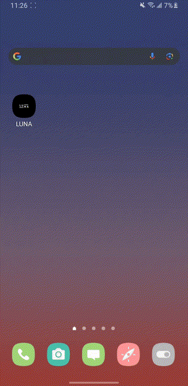

# Luna App

Luna App is the accompanying app developed for the LUNA wearable device on Expp. The app detects nearby LUNA devices with active BLE servers open and connects the smartphone to a chosen LUNA device. 


## 🚀 Key Features

* **BLE Connection**: Allows the running smartphone to connect to a LUNA device and send files from the smartphone to the device via BLE
* **WiFi Sharing**: Detects the ID of the network the smartphone is currently connected to, and allows the user to provide the password to LUNA so that it can connect
* **Cross-Platform**: Runs natively on iOS, Android, and web via responsive layouts.

 


## 📁 Repository Structure

```
/
├── android/ # Android native project
├── ios/ # iOS native project
├── app/ # Main app entry points & screens
├── assets/ # Images, fonts, demo GIF
├── context/ # React Context providers
├── hooks/ # Custom React hooks
├── app.json # Expo project config
├── package.json # Dependencies & scripts
├── tsconfig.json # TypeScript config
└── README.md # Project overview
```

## 💾 Installation

Clone the repository:

   ```bash
   git clone https://github.com/yourusername/luna-app.git
   cd luna-app
   ```
Install dependencies:

   ```bash
   npm install
   ```

## 🔧 Running the App

Start the development server and open in your preferred environment:

```bash
npx expo start
```

Choose one of the options in the Expo CLI:

* **Android emulator**
* **iOS simulator**
* **Web browser**
* **Expo Go** (mobile sandbox)

## 📈 Workflow & Scripts

* `npm start` — Launch development server.
* `npm run build:web` — Build optimized web bundle.
* `npm run reset-project` — Reset current project to a fresh template.
* `npm test` — Run unit tests.

---


*Last updated: July 21, 2025*
